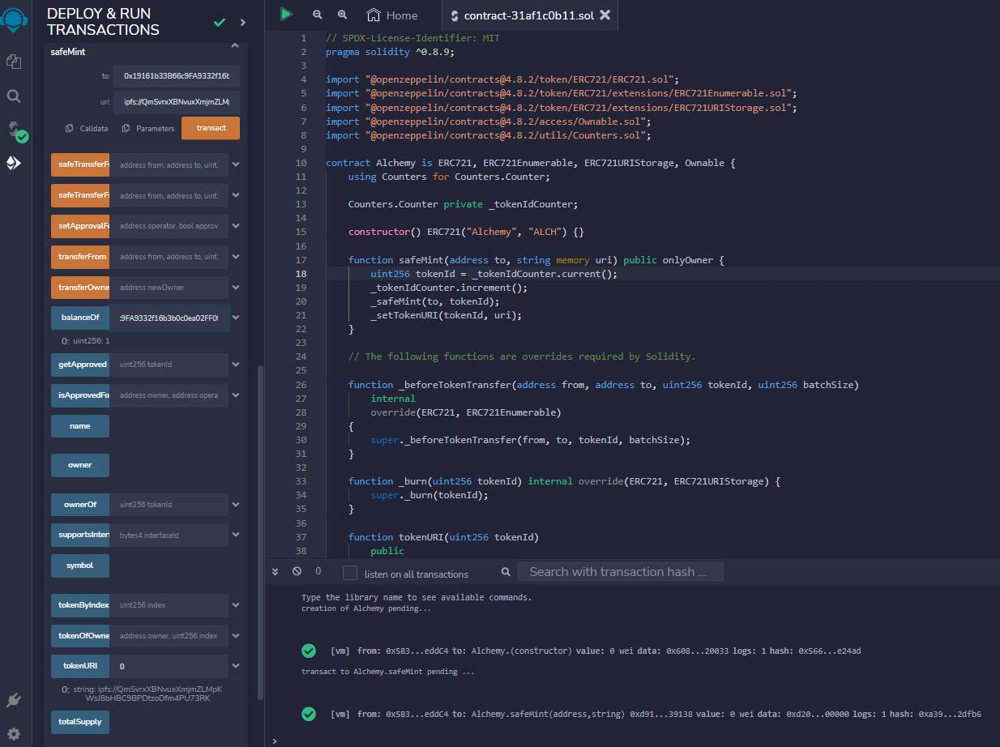
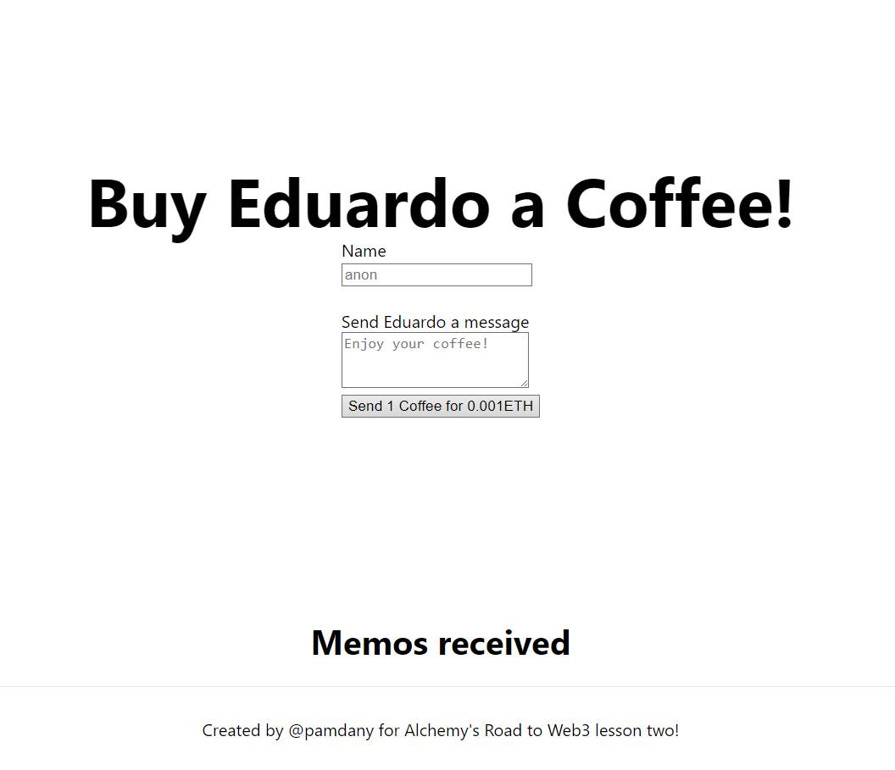
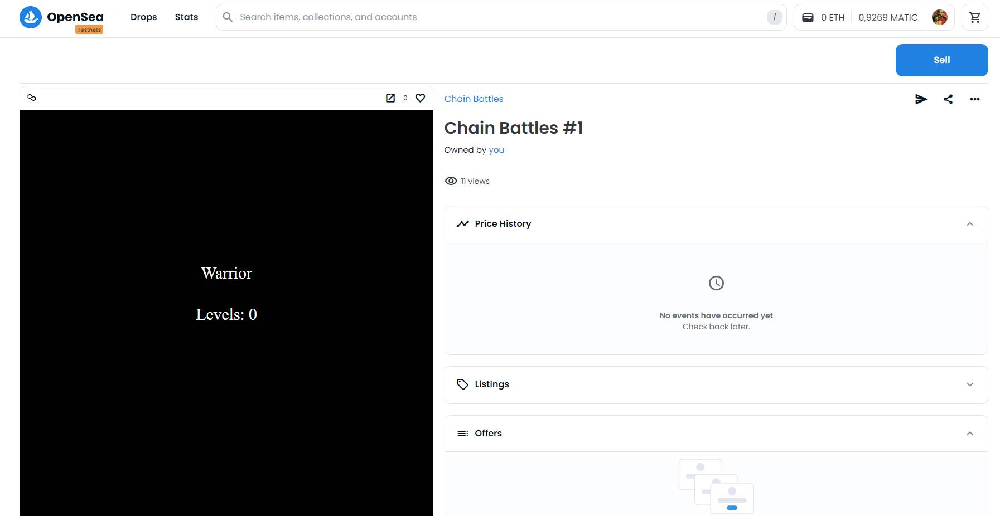
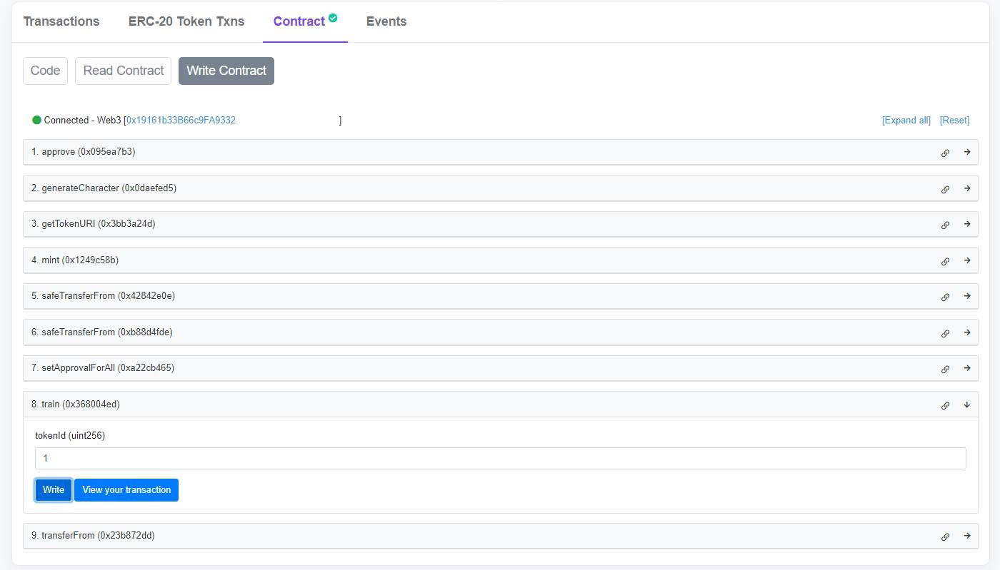
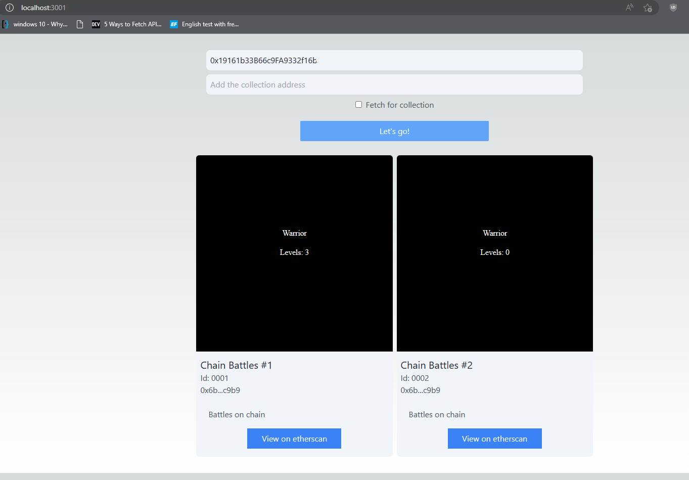

### Ejercicios de practica

Siguiendo la ruta [Welcome to the Road to Web3](https://docs.alchemy.com/docs/welcome-to-the-road-to-web3)

[Cómo desarrollar un contrato inteligente NFT (ERC721) con Alchemy](https://docs.alchemy.com/docs/how-to-develop-an-nft-smart-contract-erc721-with-alchemy)

Aunque el contrato se despliega correctamente, el método balanceOf devuelve 1, indicando que poseo un NFT y el método tokenUri, insertando "0" como argumento de id, muestra la tokenURI, en [https://testnets.opensea.io/](https://testnets.opensea.io/) no aparece.

[Cómo construir una DeFi dApp "Cómprame un café"](https://docs.alchemy.com/docs/how-to-build-buy-me-a-coffee-defi-dapp)

Funciona, pero no trae los memos. La consola devuelve un error   
`Error: call revert exception [ See: https://links.ethers.org/v5-errors-CALL_EXCEPTION ] (method="getMemos()", data="0x", errorArgs=null, errorName=null, errorSignature=null, reason=null, code=CALL_EXCEPTION, version=abi/5.6.1)`.   
Todavía no se que significa. Debo seguir leyendo documentación.

[Cómo crear NFT con metadatos On-chain con Hardhat y Javascript](https://docs.alchemy.com/docs/how-to-make-nfts-with-on-chain-metadata-hardhat-and-javascript)

Funciona mint correctamente, pero no la función train para subir de nivel

Mas documentación para leer :)

[Cómo crear una galería de NFT](https://docs.alchemy.com/docs/how-to-create-an-nft-gallery)

Funciona en la red de prueba de OpenSea

[Cómo crear un NFT dinámico](https://docs.alchemy.com/docs/connect-apis-to-your-smart-contracts-using-chainlink)

[Cómo crear una dApp de Staking](https://docs.alchemy.com/docs/how-to-build-a-staking-dapp)

[Cómo crear un mercado de NFT desde cero](https://docs.alchemy.com/docs/how-to-build-an-nft-marketplace-from-scratch)

[Cómo crear una quiniela sobre Optimism](https://docs.alchemy.com/docs/how-to-build-a-betting-game-on-optimism)

[Cómo crear una dapp de intercambio de tokens con 0x API](https://docs.alchemy.com/docs/how-to-build-a-token-swap-dapp-with-0x-api)

[Cómo crear un Twitter descentralizado con el protocolo Lens](https://docs.alchemy.com/docs/how-to-create-a-decentralized-twitter-with-lens-protocol)
